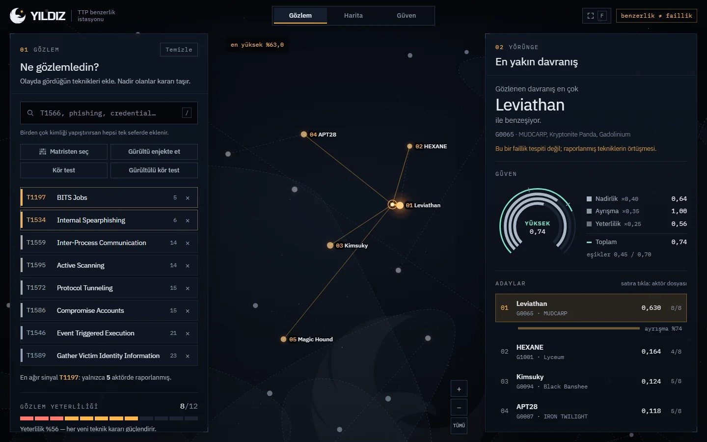
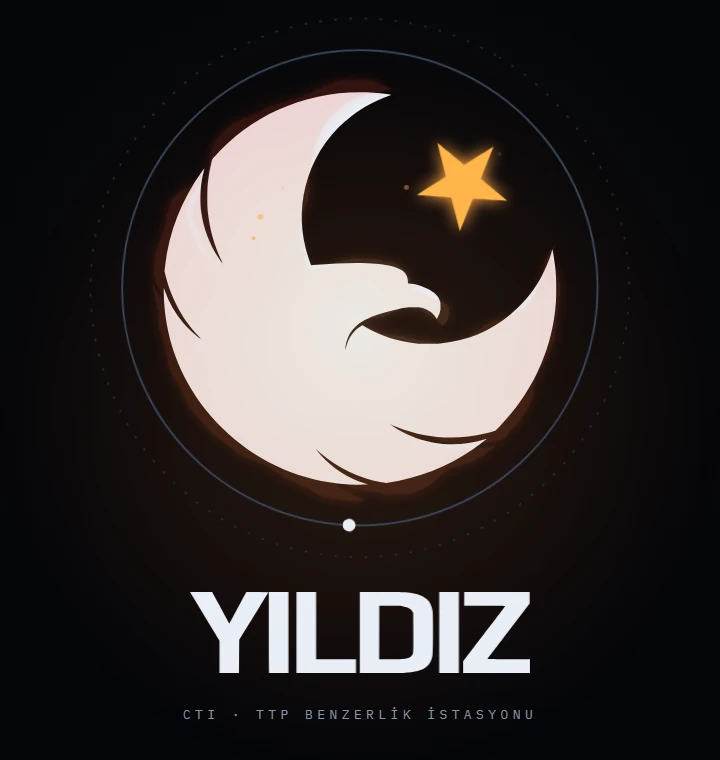
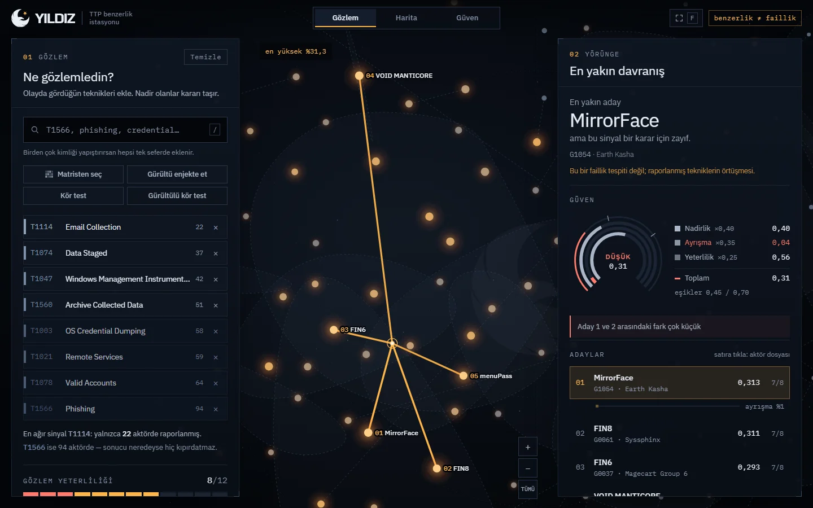
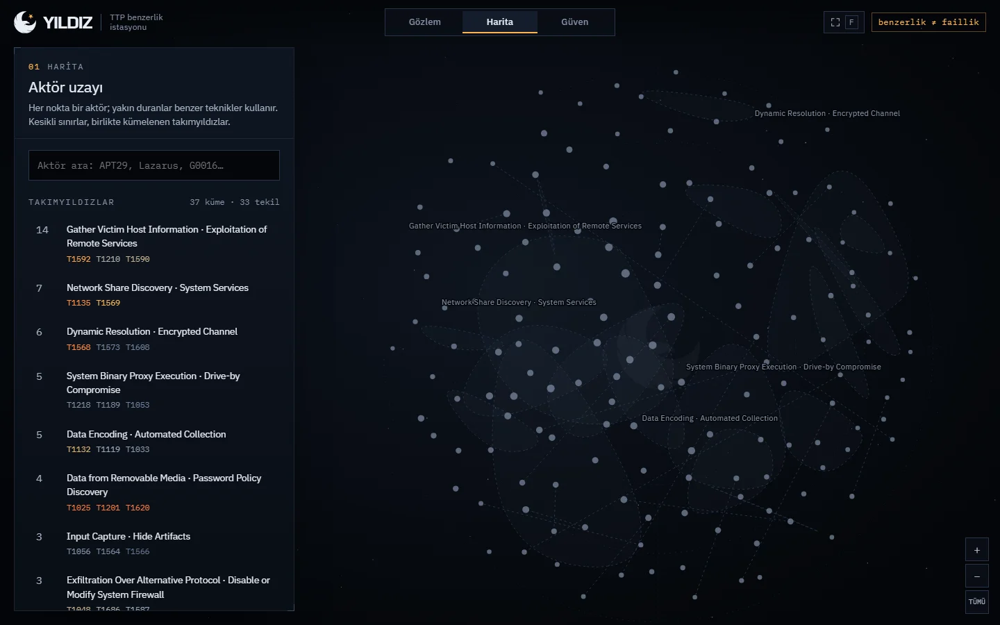
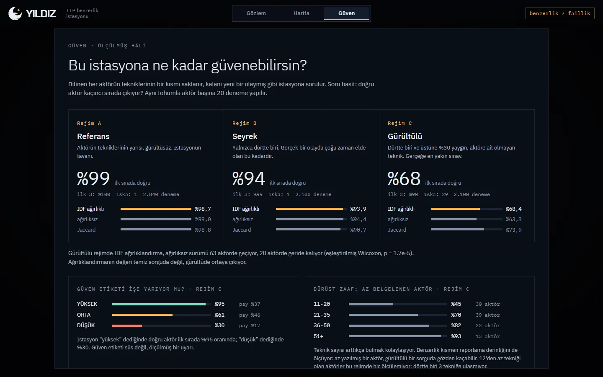
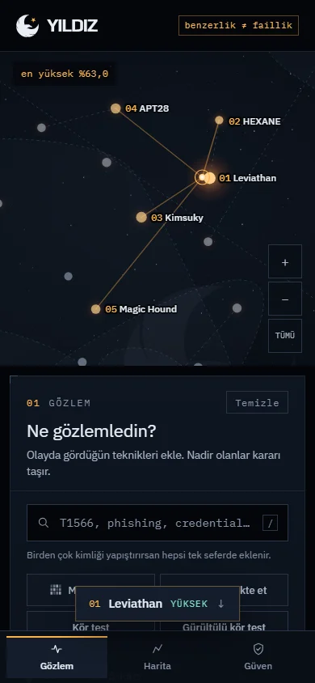

<p align="center">
  <picture>
    <source media="(prefers-color-scheme: dark)" srcset="docs/brand/yildiz-lockup-dark.svg">
    
  </picture>
</p>

<h1 align="center">TTP Benzerlik İstasyonu</h1>

<p align="center">
  Olayda gözlenen MITRE ATT&CK tekniklerini bilinen tehdit aktörleriyle <b>davranışsal benzerlik</b> üzerinden karşılaştıran,<br>
  sonucu kanıtıyla ve ölçülmüş güveniyle gösteren bir CTI analiz istasyonu.
</p>

> **Bu araç attribution (faillik atfı) yapmaz.** Yalnızca davranışsal benzerlik ölçer. Bir sorgunun bir aktöre benzemesi, o aktörün sorumlu olduğu anlamına gelmez; yalnızca raporlanmış ATT&CK tekniklerinin örtüştüğünü gösterir. Sonuçlar açık kaynak raporlamanın kapsam ve yanlılığından doğrudan etkilenir.



---

## İçindekiler

- [Ne yapar](#ne-yapar)
- [Hızlı başlangıç](#hızlı-başlangıç)
- [İstasyon arayüzü](#istasyon-arayüzü)
- [API](#api)
- [Motor: ağırlık, benzerlik, güven](#motor-ağırlık-benzerlik-güven)
- [Başarım testi](#başarım-testi)
- [Testler ve CI](#testler-ve-ci)
- [Veri kaynağı](#veri-kaynağı)
- [Dizin yapısı](#dizin-yapısı)
- [Ekip için: modüller arası sözleşme](#ekip-için-modüller-arası-sözleşme)
- [Sınırlılıklar](#sınırlılıklar)

---

## Ne yapar

İstasyonun bütün tasarımı üç fikre dayanır; arayüz bunları okutmaz, yaşatır:

1. **Nadir davranış iz bırakır.** Herkesin kullandığı teknik kimseyi işaret etmez. Her teknik IDF ile ağırlıklandırılır: az aktörde görülen teknik ağır, yaygın teknik hafif basar.
2. **Benzerlik bir mesafedir.** Her aktör, raporlanmış tekniklerinin oluşturduğu uzayda bir noktadır. Gözlem bu uzaya düşer ve en yakın komşuları sıralanır.
3. **Benzerlik, faillik değildir.** İstasyon "bu odur" demez; "en çok buna benziyor" der ve ne kadar emin olduğunu üç bileşenli, ölçülmüş bir güven skoruyla açıkça söyler.

| | |
|---|---|
| **Veri** | MITRE ATT&CK Enterprise **v19.2** · 149 aktör · 203 teknik · 3.667 raporlanmış gözlem |
| **Motor** | Smoothed IDF · kosinüs benzerliği · kapsam düzeltmesi · aglomeratif kümeleme · MDS haritası |
| **İstasyon** | FastAPI + Svelte; çevrimdışı çalışır, CDN kullanmaz |
| **Ölçülmüş başarım** | İlk sırada doğru aktör: referans %98,7 · seyrek sorgu %93,9 · gürültülü sorgu %68,4 |

---

## Hızlı başlangıç

### Docker ile (önerilen, tek komut)

```bash
docker compose up --build
```

Tarayıcıda **http://localhost:8000** adresini açın. İlk açılışta ATT&CK v19.2 paketi indirilir (~54 MB) ve motor derlenir (~1 dakika); `data/` klasörü host ile paylaşıldığı için bu yalnızca bir kez olur.

Güven ekranını besleyen ölçümleri de üretmek için (isteğe bağlı, birkaç dakika):

```bash
docker compose --profile setup run --rm setup
```

### Yerel kurulum

> **Python 3.11 zorunludur** ("3.11 ve üstü" değil; bkz. `DECISIONS.md` §10). Arayüzü derlemek için **Node 22.12+** gerekir (CI ve Docker: Node 24).

```bash
# 1) Python ortamı
python3.11 -m venv .venv
source .venv/bin/activate              # Windows: .venv\Scripts\Activate.ps1
pip install -r requirements.txt
python check_setup.py                  # her şey yolunda mı?

# 2) Arayüzü derle
cd web && npm ci && npm run build && cd ..

# 3) İstasyonu başlat (veri yoksa indirip derler)
python -m ttp_similarity.api --auto-build
```

**http://127.0.0.1:8000** — API başvurusu: **/api/docs**

<details>
<summary>Adım adım derleme ve geliştirme modu</summary>

```bash
python -m ttp_similarity.data.build --dataset attck            # ATT&CK'i indir ve normalize et
python -m ttp_similarity.engine.build --dataset attck          # ağırlık, vektör, benzerlik, küme, harita
python -m ttp_similarity.evaluation.benchmark --dataset attck --regimes   # Güven ekranı için ölçümler
python -m ttp_similarity.api                                   # http://127.0.0.1:8000
```

Arayüz üzerinde çalışırken iki terminal:

```bash
python -m ttp_similarity.api           # API: 8000
cd web && npm run dev                  # arayüz: http://localhost:5173 (API'ye proxy'ler)
```
</details>

<details>
<summary>Python 3.11 kurulu değilse</summary>

- **Windows:** [python.org](https://www.python.org/downloads/windows/) üzerinden 3.11 serisini kurun ("Add to PATH" ve "py launcher" işaretli). Doğrulama: `py -3.11 -V`; ortam: `py -3.11 -m venv .venv`.
- **Ubuntu / Debian:** `sudo apt install python3.11 python3.11-venv` (depoda yoksa `deadsnakes` PPA).
- **macOS:** `brew install python@3.11`
- **pyenv:** depodaki `.python-version` sürümü otomatik seçer: `pyenv install 3.11`.

`python check_setup.py` yanlış yorumlayıcıda da çalışır ve ne yapılması gerektiğini numaralı liste hâlinde söyler.
</details>

---

## İstasyon arayüzü

<p align="center"></p>

**Açılış.** YILDIZ amblemi ateşle oluşur: yıldız bir kıvılcımdan dönerek doğar, hilal-kartal silueti alev koronasıyla çizilir, harfler yükselir. Ardından amblem ve yazı arayüzdeki gerçek yerlerine süzülerek iner ve logonun yıldızı 149 aktör yıldızına patlar. Sahne veriyi beklemez; oturumdaki ilk açılışta tam (~3,9 sn), yenilemede ve paylaşılan bağlantıda kısa (~2,3 sn) oynar, her an `Esc` ile atlanabilir, azaltılmış hareket tercihine uyar.

| Gözlem | Zayıf sinyal |
|---|---|
|  |  |
| Nadir teknikler girildiğinde sonda haritada bir komşuluğa düşer, güven **YÜKSEK**. | Yaygın tekniklerle neredeyse herkes ışır; ayrışma düşer, başlık "bu sinyal bir karar için zayıf" der. |

| Harita | Güven |
|---|---|
|  |  |
| 149 aktör benzerlik uzayındaki gerçek konumlarında; takımyıldızlar, onları tanımlayan tekniklerle adlandırılmış. | İstasyonun ölçülmüş isabeti, güven etiketinin kalibrasyonu ve dürüst zaafları. |

### Ekranlar ve akışlar

| | |
|---|---|
| **Gözlem** | Teknikleri kimlik ya da adla ara, listeyi tek seferde yapıştır veya 15 taktik sütunlu ATT&CK matrisinden seç. Her teknik nadirliği kadar ağır iner; yeterlilik göstergesi kaç teknik daha gerektiğini söyler. |
| **Yörünge** | Güven seviyesine göre dil değiştiren başlık, üç halkalı güven kadranı (nadirlik · ayrışma · yeterlilik, eşik çizgileriyle), her yeni teknikte canlı yeniden sıralanan adaylar ve 1. ile 2. aday arasındaki ayrışma. |
| **Aktör dosyası** | Takma adlar, takımyıldız, "neden aday?" kanıt payları, aktörde görülmeyen sorgu teknikleri, taktik ayak izi, en ayırt edici teknikler ve en yakın komşular. |
| **Karşılaştırma** | İki aktörün yalnız-A / ortak / yalnız-B teknikleri; ortak tekniklerin ortalama nadirliği benzerliğin nereden geldiğini söyler. |
| **Kör test** | Gizli bir aktörün tekniklerinin %40'ı sorulur (isteğe bağlı gürültüyle); istasyonun onu bulup bulamadığını kendin gör. |
| **Gürültü enjeksiyonu** | Sorguya yaygınlığa göre seçilmiş yabancı teknikler eklenir; hangi sonucun ayakta kaldığı izlenir (benchmark'taki rejim C'nin canlı hâli). |
| **Paylaş ve dışa aktar** | Durum URL'de taşınır (bağlantıyı kopyala), Markdown özet, ATT&CK Navigator katmanı, JSON. |

### Klavye

| Tuş | İşlev |
|---|---|
| `/` | Teknik aramasına odaklan |
| `M` | ATT&CK matrisini aç / kapat |
| `F` | Odak modu: paneller gizlenir, harita tam ekran |
| `Esc` | Açık katmanı kapat (matris → karşılaştırma → dosya → odak modu); açılış sahnesini atla |
| `Enter` | Girişten gözleme geç; arama kutusunda öneriyi ya da yapıştırılan listeyi ekle |

### Esnek düzen

| Kademe | Genişlik | Düzen |
|---|---|---|
| Telefon | < 640 px | Tek sütun, ikonlu alt gezinti, sonuca götüren hap, dosya açılınca otomatik kaydırma |
| Tablet | 640–959 px | Harita üstte, Gözlem ve Yörünge yan yana |
| Dizüstü | 960–1279 px | Harita ortada, daralan paneller, odak modu |
| Masaüstü | ≥ 1280 px | Harita ortada, geniş paneller; ≥ 1680 px'te daha da geniş |

<p align="center"></p>

Metin renkleri her zeminde WCAG AA'yı geçer, klavye odağı her zaman görünür, dokunmatik hedefler en az 36–44 px'tir, fontlar ve kütüphaneler pakete gömülüdür.

---

## API

İstasyon tek süreçtir: `/api/*` JSON döner, geri kalan yollar derlenmiş arayüzü sunar. Etkileşimli başvuru: **http://127.0.0.1:8000/api/docs**

| Uç nokta | Ne verir |
|---|---|
| `GET /api/station` | Arayüzün açılış verisi: veri seti bilgisi, skorlama ayarları, taktikler, teknikler (nadirlik ısısıyla), aktörler (harita konumuyla), takımyıldızlar |
| `POST /api/query` | `{"techniques": [...] \| "yapıştırılmış metin", "top_k": 10}` → adaylar, kanıt payları, güven bileşenleri, sondanın harita konumu, skor alanı |
| `GET /api/actors/{id}` | Aktör dosyası |
| `GET /api/compare?a=&b=` | İki aktörün ortak ve ayrık teknikleri, benzerlik, Jaccard |
| `POST /api/noise` | Sorguya eklenecek, yaygınlığa göre seçilmiş yabancı teknikler |
| `POST /api/blind` | Kör test vakası |
| `GET /api/trust` | Benchmark rejim sonuçları (üretildiyse) |
| `GET /api/health` | Sağlık kontrolü |

```bash
curl -s localhost:8000/api/query -H 'Content-Type: application/json' \
  -d '{"techniques": "T1197 T1534 T1559 T1595 T1572 T1586", "top_k": 3}'
```

Girdiler sınırlandırılmıştır (sorgu başına en fazla 400 teknik, `top_k` 1–50, aktör kimliği deseni), yanıtlar CSP ve güvenlik başlıklarıyla döner.

**Python'dan:**

```python
from ttp_similarity.engine import rank_actors

for r in rank_actors(["T1566", "T1059", "T1078", "T1003"], top_k=5):
    print(f"{r['actor_name']:<24} skor={r['similarity_score']:.3f}  "
          f"eşleşen={r['match_count']}  kapsam={r['technique_coverage']:.0%}  "
          f"güven={r['confidence_level']}")
```

`confidence_*` alanları sorgunun bütününü (1. adayın diğerlerinden ne kadar ayrıştığını) anlatır; her satırda aynıdır.

**Komut satırından:**

```bash
python -m ttp_similarity.engine.query T1566 T1078 T1047 T1003
python -m ttp_similarity.engine.query T1566 T1078 T1047 T1003 --json
```

---

## Motor: ağırlık, benzerlik, güven

| Adım | Dosya | Çıktı |
|---|---|---|
| 1 | `engine/weighting.py` | `weights.csv` — smoothed IDF |
| 2 | `engine/vectorize.py` | `vector_space.npz` — L2 normalize ağırlıklı aktör vektörleri |
| 3 | `engine/similarity.py` | `similarity.npz` — aktörler arası kosinüs |
| 4 | `engine/clustering.py` | `clusters.csv` — aglomeratif kümeler (ortalama bağlantı) |
| 5 | `engine/layout.py` | `layout.csv` — metrik MDS ile 2-B harita |
| 6 | `engine/query.py` | sorgu, kapsam düzeltmesi, kanıt |
| 7 | `engine/confidence.py` | üç bileşenli güven |

**Ağırlık.** `w(t) = ln((N + 1) / (df(t) + 1)) + 1`. Taban 1 sayesinde yaygın bir teknik sıfıra düşmez; tavan analitik olarak sınırlıdır, tek bir nadir eşleşme skoru ezemez.

**Skor.** Kosinüs, aktörün sorguyu kapsama oranıyla çarpılır (`COVERAGE_CORRECTION`): birkaç ağır eşleşmeyle sorgunun çoğunu görmezden gelen aktör cezalandırılır.

**Kanıt.** Her eşleşen tekniğin payı skorun gerçek ayrışımıdır: kosinüste `w²` ile orantılı; paylar skoru birebir yeniden üretir.

**Güven** bir olasılık değildir; sıralamanın ne kadar dayanaklı olduğunu üç bileşenle ölçer:

| Bileşen | Sorduğu soru | Ağırlık |
|---|---|---|
| **Nadirlik** | Eşleşen teknikler ayırt edici mi? (veriden, skorlama şemasından bağımsız) | 0,40 |
| **Ayrışma** | 1. aday tüm sıralamadaki 2. adaydan gerçekten ayrışıyor mu? (`top_k`'dan bağımsız) | 0,35 |
| **Yeterlilik** | Karar vermeye yetecek kadar teknik var mı? (3 → 12) | 0,25 |

Toplam ≥ 0,70 **YÜKSEK**, ≥ 0,45 **ORTA**, altı **DÜŞÜK**; 3'ten az bilinen teknikle her zaman DÜŞÜK. Tanınmayan kimlikler sessizce atılmaz, ayrıca raporlanır. Bütün eşikler `config.py`'de, gerekçeleri `DECISIONS.md`'dedir.

---

## Başarım testi

Bilinen bir aktörün tekniklerinin bir kısmı saklanır, kalanı yeni bir olaymış gibi sorulur; doğru aktörün kaçıncı sırada çıktığına bakılır. Aktör başına 20 tekrar, sabit tohum.

```bash
python -m ttp_similarity.evaluation.benchmark --dataset attck             # tek koşu
python -m ttp_similarity.evaluation.benchmark --dataset attck --regimes   # üç zorluk rejimi
python -m ttp_similarity.evaluation.benchmark --dataset attck --compare   # şema / eşik / kapsam karşılaştırması
python -m ttp_similarity.evaluation.case_study --dataset attck --actor G0065
```

| Rejim | Sorgu | top-1 (IDF) | top-3 | Iska |
|---|---|---:|---:|---:|
| A — referans | tekniklerin %50'si | %98,7 | %99,8 | 1 |
| B — seyrek | %25 | %93,9 | %98,6 | 1 |
| C — gürültülü | %25 + %30 yabancı teknik | %68,4 | %89,8 | 29 |

Gürültülü rejimde IDF ağırlıklandırma, ağırlıksız sürümü 63 aktörde geçer, 20 aktörde geride kalır (eşleştirilmiş Wilcoxon, p = 1,7×10⁻⁵). Güven etiketi kalibredir: rejim C'de YÜKSEK dediğinde %95, DÜŞÜK dediğinde %30 isabet.

Bayraklar: `--scheme smooth_idf|plain_idf|binary` · `--metric cosine|jaccard` · `--min-techniques` · `--coverage-correction / --no-coverage-correction` · `--fraction` · `--repeats` · `--seed`. Çıktılar `outputs/reports/<veri-seti>/` altına CSV ve okunur metin rapor olarak yazılır.

> Sorgular motorun indekslediği aynı ATT&CK kayıtlarından çekilir; ölçülen şey **erişim tutarlılığıdır**, gerçek dünya faillik doğruluğu değil.

---

## Testler ve CI

```bash
pytest                         # 155 test: motor, API, sözleşme, bütünlük, sürüm sabitleme
cd web && npm test             # 39 birim testi: ayrıştırma, arama, URL durumu, geometri, uçuş, dışa aktarma
cd web && npm run e2e          # 25 uçtan uca senaryo (istasyon çalışırken, gerçek ATT&CK verisiyle)
```

Uçtan uca senaryolar Chromium tabanlı bir tarayıcıyı (Edge / Chrome / Chromium ya da `CHROME_PATH`) DevTools protokolüyle sürer. Kapsananlar:

- Açılış sahnesinin tam, kısa ve atlanmış hâlleri ve logonun yerine inmesi
- Sorgu, matris, aktör dosyası ve karşılaştırma
- Odak modu ve harita araması
- Güven ekranı, kör test ve gürültü enjeksiyonu
- Telefon düzeni
- Konsol hatası olmaması

CI (`.github/workflows/ci.yml`) her push'ta Python 3.11 testlerini, arayüz testleri ve derlemesini ve Docker imaj derlemesini çalıştırır.

### Marka varlıkları

Amblem ve kelime logosunun kaynakları `docs/brand/source/` altındadır. Arayüzdeki vektör yollar (`web/src/lib/brand.js`), favicon'lar ve README logoları bu kaynaklardan tek komutla üretilir; çıktı birebir tekrarlanabilir:

```bash
pip install pillow potracer
python tools/brand/build_brand.py
```

---

## Veri kaynağı

**MITRE ATT&CK Enterprise, STIX 2.1** — `https://raw.githubusercontent.com/mitre-attack/attack-stix-data/v19.2/enterprise-attack/enterprise-attack.json`

- Sürüm `config.ATTACK_RELEASE = "v19.2"` ile **sabitlenmiştir**; aynı kod her zaman aynı paketi indirir.
- `intrusion-set` → aktör, `attack-pattern` → teknik, `relationship (uses)` → aktör-teknik ilişkisi.
- Alt teknikler ana tekniğe indirgenir (`T1059.003` → `T1059`); revoked/deprecated nesneler ve 5'ten az tekniği olan aktörler elenir; takma adı paylaşan kayıtlar birleştirilir.
- Paket `data/raw/` altında önbelleğe alınır; yanına kaynak URL, indirme zamanı, ETag ve SHA-256 içeren `enterprise-attack.meta.json` yazılır.

MITRE ATT&CK içeriği MITRE tarafından [ATT&CK Terms of Use](https://attack.mitre.org/resources/legal-and-branding/terms-of-use/) kapsamında sağlanır.

---

## Dizin yapısı

```
ttp-similarity-engine/
├── ttp_similarity/
│   ├── schema.py            # ortak veri modeli — önce burayı okuyun
│   ├── paths.py             # tüm dosya yolları (Workspace)
│   ├── config.py            # eşikler, ağırlıklar, ayarlar
│   ├── storage.py           # diske okuma/yazma
│   ├── data/                # aşama 1: ATT&CK → temiz aktör-teknik tablosu
│   ├── engine/              # aşama 2: ağırlık, vektör, benzerlik, küme, harita, sorgu, güven
│   ├── evaluation/          # aşama 3: benchmark, vaka çalışması
│   └── api/                 # aşama 4: istasyon — FastAPI servisi
├── web/                     # istasyon arayüzü (Svelte + Vite)
│   ├── src/components/      # harita, gözlem, yörünge, dosya, karşılaştırma, güven, marka
│   ├── src/lib/             # durum, API istemcisi, ayrıştırma, arama, geometri, marka yolları
│   └── e2e/                 # uçtan uca senaryolar
├── tests/                   # pytest
├── docs/                    # marka (kaynak PNG + vektör), ekran görüntüleri
├── tools/brand/             # kaynak logolardan bütün marka varlıklarını üretir
├── data/                    # üretilen veri (git'e girmez)
├── outputs/                 # raporlar (git'e girmez)
├── Dockerfile               # Node derleme + Python 3.11 çalışma imajı
├── docker-compose.yml
├── check_setup.py           # tek komutla kurulum doğrulama
├── requirements.txt         # sabitlenmiş bağımlılıklar
├── README.md
└── DECISIONS.md             # yöntem, eşik ve tasarım kararları
```

---

## Ekip için: modüller arası sözleşme

1. **Önce `ttp_similarity/schema.py` okunur.** Modül sınırını geçen her şey orada tanımlıdır.
2. **Dosya yolları elle yazılmaz:** `paths.Workspace.get("attck").weights`.
3. **Dosyalar elle açılmaz:** `storage.*` kullanılır; eksik girdide hangi komutun çalıştırılacağını söyleyen hata gelir.
4. **Eşik ve sabitler kod içine gömülmez:** hepsi `config.py`'dedir; değiştiğinde `DECISIONS.md` de güncellenir.
5. **Arayüzde skorlama yapılmaz:** her sayı motordan gelir; API yalnızca motorun çıktısını arayüzün çizdiği şekle getirir.
6. **Sahte veri seti (`mock`) yalnızca test fixture'ıdır;** arayüzde ve varsayılanlarda kullanılmaz.

---

## Sınırlılıklar

- ATT&CK grup kayıtları **açık kaynak raporlamaya** dayanır. Çok yazılmış bir aktörün teknik listesi uzun, az yazılmış bir aktörünki kısadır; benzerlik bir ölçüde raporlama yoğunluğunu ölçer. Gürültülü sorguda az belgelenmiş aktörleri bulmak belirgin biçimde zordur (Güven ekranında açıkça gösterilir).
- Aktörler zaman içinde davranış değiştirir; ATT&CK kayıtları bunu tarihlendirmez, model zamansızdır.
- Aynı araç setini kullanan farklı aktörler birbirine benzer görünür.
- Bu araç bir tespit sistemi değildir ve olay müdahale kararlarının tek dayanağı olarak kullanılmamalıdır.
